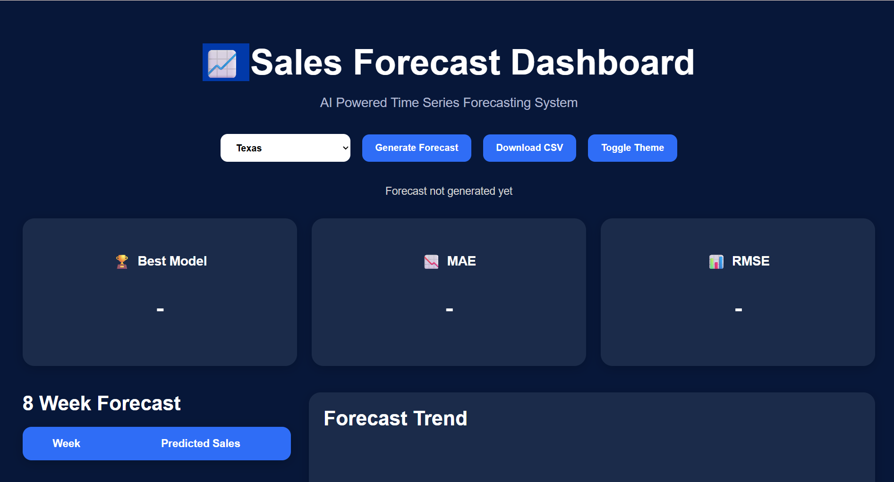
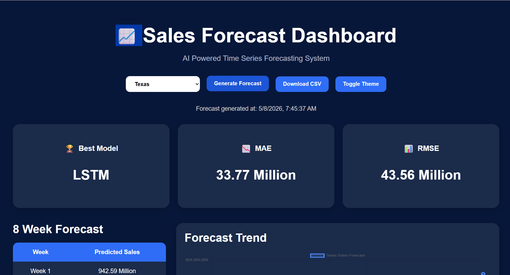
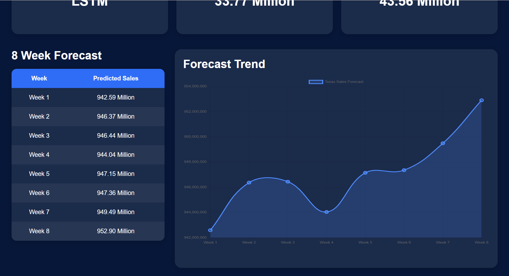

# Sales Forecasting System
## Screenshots

### Dashboard


### Result Page




## Overview

An end-to-end AI powered sales forecasting system that predicts next 8 weeks sales for each state using multiple machine learning and deep learning models.

## Features

- ARIMA Forecasting
- Facebook Prophet
- XGBoost with Lag Features
- LSTM Deep Learning
- Automatic Best Model Selection
- FastAPI REST API
- Interactive Dashboard
- State-wise Forecasting
- CSV Export
- Dark/Light Theme

## Tech Stack

- Python
- FastAPI
- XGBoost
- TensorFlow
- Prophet
- Pandas
- Chart.js
- HTML/CSS/JavaScript

## Models Used

1. ARIMA
2. Prophet
3. XGBoost
4. LSTM

## Feature Engineering

- Lag Features
- Rolling Mean
- Rolling Std
- Weekday Feature
- Holiday Flag

## Run Project

```bash
uvicorn api.main:app --reload
```

Open:

```text
http://127.0.0.1:8000/dashboard
```
